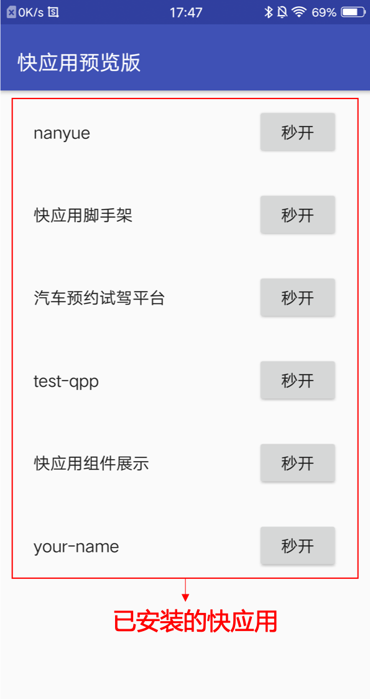
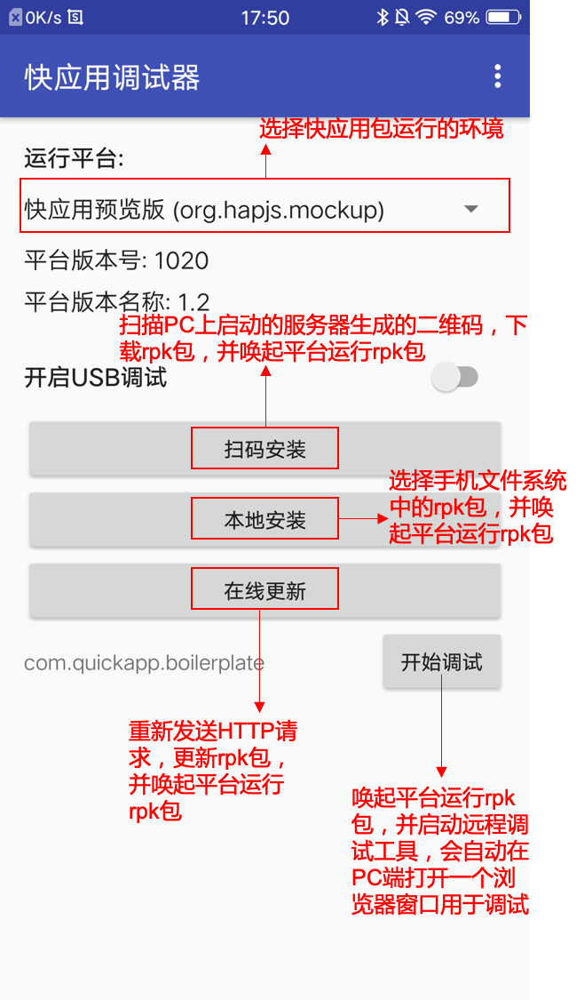

## 快应用开发教程（1）：开发前的准备工作

正所谓工欲善其事必先利其器，想要优雅快速的开发快应用，离不开各种开发工具辅助，按照下面的步骤，帮助你快速的搭建起自己的快应用开发环境。

### 开发环境

* nodejs >= 6.0
* npm或者yarn

### 开发工具

快应用有[官方的IDE](https://www.quickapp.cn/docCenter/post/97)，官方IDE支持一键安装和打包，使用起来非常方便，[IDE使用教程](https://bbs.quickapp.cn/forum.php?mod=viewthread&tid=1052&extra=page%3D1)。下面我们使用的是命令行工具开发的教程。

* hap-toolkit
* [快应用预览版apk](https://statres.quickapp.cn/quickapp/quickapp/201806/file/quickapp_platform_preview_release_v1020.apk)
* [快应用调试器apk](https://statres.quickapp.cn/quickapp/quickapp/201806/file/quickapp_debugger.apk)
* 安卓手机一部

 ###  PC开发环境配置

1. 检测当前环境的npm版本

```javascript
node --version
```

如果输出的版本低于6.0，请自行升级到以上版本，可以在node[官网](https://nodejs.org/en/)下载安装最新版本。

2. 安装hap-toolkit

hap-toolkit是一个集成了快应用开发所需要的初始化项目、打包、压缩、发布、调试等功能的命令行工具，是开发快应用不可或缺的一个工具。

```javascript
npm install -g hap-toolkit // 参数-g意思是全局安装
```

安装完成后在命令行里输入

```
hap -V // 注意参数V是大写
```

此时若输出版本号，则说明安装成功了。

**hap-toolkit常用命令列表**

```
hap init <project_name> // 生成一个快应用项目脚手架
hap build // 打包快应用，在线项目文件夹下生成build和dist文件夹
hap watch // 持续监测快应用项目文件的变化，监测到变化后自动编译打包
hap server // 打开一个本地服务器，用于手机扫码预览打包好的快应用
hap release // 构建一个用于发布版本的rpk包，包的名称带有release
```

这些命令的详细参数配置可以使用这样的方式`hap <command> -h`查看。

### 手机预览调试环境配置

由于目前快应用仅支持真机预览和调试，所以开发快应用的时候需要你准备一部安卓系统的手机，下面是给手机配置预览和调试的工作。你可以在[这里](https://www.quickapp.cn/docCenter/post/69)下载到下面的apk等资源。为了方便手机安装，本文后面附上了资源下载链接的二维码。

1. 安装[手机预览版apk](https://statres.quickapp.cn/quickapp/quickapp/201806/file/quickapp_platform_preview_release_v1020.apk)：这个app的作用是让没有内置快应用运行环境的手机能够跑快应用，本质就是一个快应用的运行环境。

   

2. 安装[手机调试器apk](https://statres.quickapp.cn/quickapp/quickapp/201806/file/quickapp_debugger.apk)：这个app的作用是安装和调试快应用。

   

以上就是快应用开发环境和工具手动安装与搭建的方法和步骤，当上面的所有工具准备就绪，就可以进行下一步的程序开发工作了。

### 代码编辑器的配置

快应用项目的开发不限定你使用什么编辑器，你可以选择自己熟悉的编辑器进行快应用的开发。除了快应用官方的IDE能自动识别快应用的`*.ux`后缀名的文件，其他编辑器都需要你再手动配置一下，具体配置可以见[快应用官方文档链接](https://doc.quickapp.cn/tutorial/getting-started/code-edit-conf.html)。下面给出常用的编辑器的下载链接。

1. [sublime](https://www.sublimetext.com/)
2. [webstorm](https://www.jetbrains.com/webstorm/)
3. [vscode](https://code.visualstudio.com/)
4. [快应用官方IDE](https://www.quickapp.cn/docCenter/post/97)

### 资源下载

* 快应用调试器扫码下载

  

* 快应用预览版扫码下载

  

  ------------------

  作者：dadong

  时间：2018.11.20

