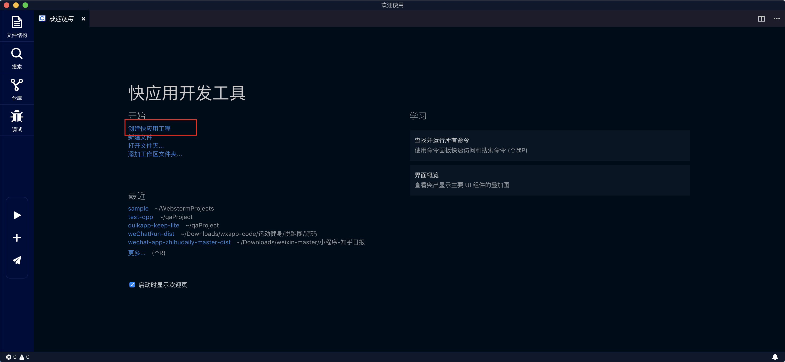
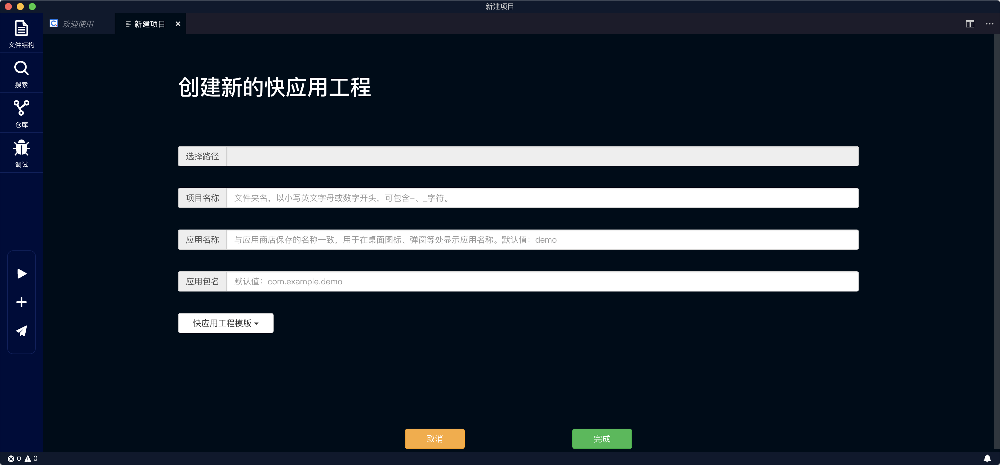
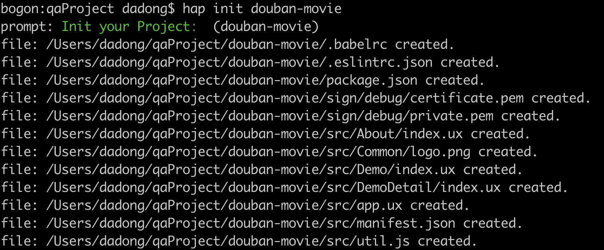
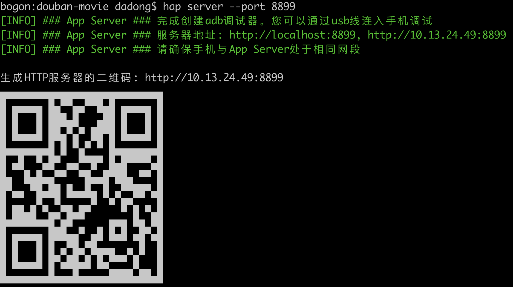

## 快应用开发教程（2）：项目框架搭建

上一篇文章我们讲了如何搭建一个完整的快应用开发环境，这一篇文章开始我们进入实际的快应用开发，首先我们需要一个快应用开发的脚手架，当然从零开始搭建也是可以的，不过很多东西都是重复繁琐的，为了节省时间我们直接用官方脚手架进行开发。

这一次的目标是开发一个电影信息的快应用。先不要担心API和UI的问题，后面会慢慢一步一步的讲到。

#### 一、初始化项目

##### IDE的方式





##### 命令行的方式

1. 使用`hap init <project-name>`初始化一个快应用项目。

   

2. 进入项目目录，然后运行`npm install`安装项目依赖。

   

3. 依赖安装完成后，使用`hap watch`命令编译整个快应用项目，上一篇有讲到`hap watch`命令会实时监测项目中文件的变化，检测到变化后会自动打包编译，省却了开发中我们需要频繁手动编译的麻烦。

4. 接下来我们需要运行`hap server`命令，开启一个本地的服务，开启成功后会输出一个二维码，用手机调试器扫码即可在手机预览效果。默认端口是12306，你也可以使用自定义端口`hap server --port <port>`。

   

#### 二、优化项目结构

上面我们通过`hap init`生成的项目跑起来了一个脚手架快应用，可以看到项目的结构。

```diff
├── sign                      rpk包签名模块
│   └── debug                 调试环境
│       ├── certificate.pem   证书文件
│       └── private.pem       私钥文件
├── src
│   ├── Common                公用的资源和组件文件
│   │   └── logo.png          应用图标
│   ├── About                 页面目录
│   |   └── index.ux          页面文件，可自定义页面名称 
│   ├── Demo                  页面目录
│   |   └── index.ux          页面文件，可自定义页面名称 
│   ├── DemoDetail            页面目录
│   |   └── index.ux          页面文件，可自定义页面名称
│   ├── app.ux                APP文件，可引入公共脚本，暴露公共数据和方法等
│   └── manifest.json         项目配置文件，配置应用图标、页面路由等
└── package.json              定义项目需要的各种模块及配置信息
```

##### 配置babel插件

 如果你使用的`hap-toolkit`版本低于`0.0.37`那么你就无法在快应用中使用`spread`和`rest`语法，所以我们需要手动增加一个babel插件`babel-plugin-transform-object-rest-spread`，这个插件可以通过以下步骤安装配置。

1. 使用命令`npm install babel-plugin-transform-object-rest-spread --save-dev`安装插件并添加开发依赖；

2. 在项目根目录下新建文件`.babelrc`，在文件中写入内容

   ```json
   {
     "presets": [
       "env"
     ],
     "plugins": [
       "babel-plugin-transform-object-rest-spread"
     ]
   }
   ```

重新运行下`hap watch`即可生效，现在你就可以在项目中使用`spread`和`rest`语法了。

##### 增加UI组件库

由于目前快应用官方并没有UI组件规范，原生的组件又不是很美观，所以我们采用一套目前开源的UI组件库作为我们的项目基础，节省我们调整原生组件样式的时间。这一套组件库叫做[Quist-UI](https://github.com/JDsecretFE/quist-ui)，使用方法如下。

1. 使用命令`npm install quist-ui -D`安装并添加依赖；

2. 在项目目录下新建`config`文件夹，并在`config`文件夹下新增`webpack.config.js`文件，在文件中写入

   ```javascript
   var path = require('path')
   module.exports = {
     postHook: function(webpackConf, options){
       webpackConf.resolve.alias = Object.assign(webpackConf.resolve.alias || {}, {
         '@quist-ui': path.join(process.cwd(), 'node_modules/quist-ui/components')
       })
     }
   }
   ```

重启服务即可在项目中使用组件库的组件了，具体的组件使用方法可以[参考文档](https://jdsecretfe.github.io/quist-ui/guide/)

##### 调整项目结构

现在我们删除掉脚手架中不需要的页面和目录`About`和`DemoDetail`，修改一下目录的命名，为`common`目录下增加`picture`目录和`component`目录，调整后的目录是下面这样的。

```json
├── sign                      rpk包签名模块
│   └── debug                 调试环境
│       ├── certificate.pem   证书文件
│       └── private.pem       私钥文件
├── config                    项目配置文件目录
│   └── webpack.config.js     webpack配置文件
├── src
│   ├── common                公用的资源和组件文件
│   │   └── picture           公用图片资源  
│   │   │   └── logo.png      应用图标
│   │   └── component         公共组件
│   ├── page                  应用页面
│   │   └── index             应用首页目录
│   │   │   └── index.ux      应用首页文件
│   ├── app.ux                APP文件，可引入公共脚本，暴露公共数据和方法等
│   └── manifest.json         项目配置文件，配置应用图标、页面路由等
└── package.json              定义项目需要的各种模块及配置信息
```

调整之后不要忘了修改`manifest.json`文件中对应的字段`icon`、`router`和`display`

```json
{
  "package": "com.quick.movie",
  "name": "quick-movie",
  "versionName": "1.0.0",
  "versionCode": "1",
  "minPlatformVersion": "101",
  "icon": "/common/picture/logo.png",
  "features": [
    { "name": "system.prompt" },
    { "name": "system.router" },
    { "name": "system.shortcut" }
  ],
  "permissions": [
    { "origin": "*" }
  ],
  "config": {
    "logLevel": "off"
  },
  "router": {
    "entry": "page/index",
    "pages": {
      "page/index": {
        "component": "index"
      }
    }
  },
  "display": {
    "titleBarBackgroundColor": "#f2f2f2",
    "titleBarTextColor": "#414141",
    "menu": true,
    "pages": {
      "page/index": {
        "titleBarText": "首页",
        "menu": false
      }
    }
  }
}
```

以上调整完成后，我们便可以在`src/page/index/index.ux`文件中开发我们豆瓣电影快应用的第一个页面了。

-------------

作者：dadong

时间：2018.11.21