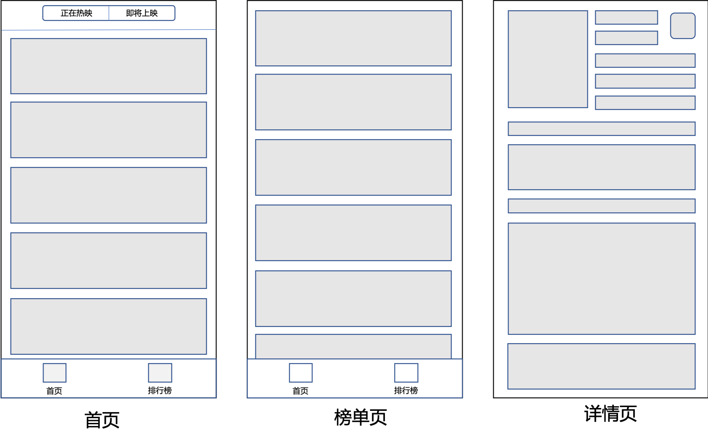

## 快应用开发教程（3）：APP开发实战-页面开发

上一篇中我们最后搭建出了一个可以开发的快应用项目，优化了项目的结构，为项目增加了可以拿来就用的UI组件库，接下来我们正式开始快应用的开发。

### 需求分析

首先我们明确要开发的快应用需要哪些功能，我简单罗列一下第一版本的功能需求。

* 需要一个查看正在上映的电影页面
* 需要一个查看即将上映的电影页面
* 需要一个查看电影详细信息的页面
* 需要一个查看电影排行榜单的页面

第一版本的APP我们暂定实现这四个需求。现在我们分解一下这四个需求，对应到我们要开发的具体页面上去。首先我们可以把正在上映和即将上映的电影放在一个页面，对应APP的一个tabbar，详细信息页面作为点击单个电影之后的跳转的详情页面，电影榜单则作为tabbar的第二个页面。下面是根据这个需求分析做的一个简略的说明图。



### 界面搭建

根据上面的页面结构，我们可以开始进行项目中的页面配置了。

#### 1.增加页面文件和目录

目录结构增加情况

```diff
   ├── src
   │   └── page                  应用页面
   │        └── index             应用首页目录
   │        │   └── index.ux      应用首页文件
+  │        └── top               榜单页目录
+  │        │   └── index.ux      榜单页文件
+  │        └── index             详情页目录
+  │            └── index.ux      详情页文件
   └── package.json              定义项目需要的各种模块及配置信息
```

增加的页面在`manifest.json`中对应字段修改

```diff
{
  "router": {
    "entry": "page/index",
    "pages": {
      "page/index": {
        "component": "index"
      },
+      "page/top": {
+        "component": "index"
+      },
+      "page/detail": {
+        "component": "index"
+      }
    }
  },
  "display": {
-    "titleBarBackgroundColor": "#f2f2f2",
-    "titleBarTextColor": "#414141",
+    "titleBarBackgroundColor": "#00B51D",
+    "titleBarTextColor": "#ffffff",
    "menu": true,
    "pages": {
      "page/index": {
        "titleBarText": "首页",
        "menu": false
      },
+      "page/top": {
+        "titleBarText": "排行榜",
+        "menu": false
+      },
+      "page/detail": {
+        "titleBarText": "详情页",
+        "menu": false
+      }
    }
  }
}
```


#### 2.编写首页界面

**需要注意的是，快应用的样式布局和web有比较多不同的地方，快应用的布局都采用flex方式实现，如果你不以前没有用过flex，请提前熟悉flex布局相关的概念和属性。这里推荐看[阮一峰flex布局的博文](http://www.ruanyifeng.com/blog/2015/07/flex-grammar.html)**

首页可以看到需要一个顶部的筛选组件，中间是电影列表组件，底部是tabbar组件。我们分别开始编写。

* 顶部筛选组件

**顶部筛选组件是固定在页面顶部的，所以定位的方式采用`position:fixed`来实现，由于固定在顶部会占用页面的高度，中级的列表也要相应的减掉这一部分的高度，列表中的内容才不会被挡住。所以中间的列表容器元素需要添加`margin-top:100px`样式规则。**

`template`部分代码

```html
<template>
    <div class="container">
        <div class="filter-wrap">
            <text class="filter active">正在热映</text>
            <text class="filter">即将上映</text>
        </div>
    </div>
</template>
```

`style`部分代码

```css
.container {
    display: flex;
}

.filter-wrap {
    position: fixed;
    top: 0;
    left: 0;
    height: 100px;
    width: 100%;
    background-color: #00B51D;
    justify-content: center;
    align-items: center;
}

.filter {
    text-align: center;
    color: #ffffff;
    width: 200px;
    height: 50px;
    border: 1px solid #ffffff;
    font-size: 24px;
}

.active {
    background-color: #ffffff;
    color: #00B51D;
}
```

现在筛选器的界面已经写出来


* 中间列表组件

中间的列表我们采用官方的`list`组件来实现，官方的`list`组件在渲染的时候会复用相同`type`属性的`list-item`，这样会提高我们的渲染效率和性能。**需要注意的是不同结构的`list-item`是不可以用相同的type属性的，会造成应用崩溃。**

`template`部分代码

```html
<list class="movie-list">
    <block for="[1,2,3,4,5]">
        <list-item type="movie">
            <div class="movie">
                <div class="poster">
                    <image src=""></image>
                </div>
                <div class="info">
                    <div class="top">
                        <div class="title">
                            <text class="name">毒液</text>
                            <text class="year">2018</text>
                        </div>
                        <div class="rating">
                            <text class="average">9.0</text>
                        </div>
                    </div>
                    <div class="bottom">
                        <div class="wrap">
                            <text>类型 </text>
                            <text>科幻</text>
                        </div>
                        <div class="wrap">
                            <text>演员 </text>
                            <text>广东吴彦祖</text>
                        </div>
                        <div class="wrap">
                            <text>导演 </text>
                            <text>广东彭于晏</text>
                        </div>
                    </div>
                </div>
            </div>
        </list-item>
    </block>
    <list-item type="nomore">
        <text>没有更多了~</text>
    </list-item>
</list>
```

`style`部分代码

```css
.movie {
    height: 300px;
    margin: 20px 20px 0 20px;
    width: 100%;
    flex-direction: row;
}

.info {
    flex-direction: column;
    flex-grow: 1;
    padding: 0 20px;
}

.top {
    flex-direction: row;
    justify-content: space-between;
    margin-bottom: 30px;
}

.bottom {
    flex-direction: column;
    flex-grow: 1;
    justify-content: space-around;
}

.bottom text {
    font-size: 26px;
}

.name {
    font-size: 36px;
}

.title {
    flex-direction: column;
}

.poster {
    width: 230px;
}

.poster image {
    width: 100%;
    height: 100%;
}

.rating {
    height: 100px;
    width: 100px;
    border-radius: 20px;
    background-color: #f0f3f5;
    justify-content: center;
}

.average {
    color: #27a;
}
```

现在列表布局的界面已经写出来


* 底部选项卡

快应用中的底部选项卡没有提供类似于微信小程序的配置方式，所以需要我们自己来写一个通用的组件，底部选项卡组件我们可以使用官方的`tabs`组件来实现，当然也可以使用其他组件来模拟实现。这里我们使用的`div`组件模拟完成。

**底部选项卡是要固定在页面底部的，所以需要我们可以采用`position:fixed`的方式实现，由于选项卡在底部占用了页面高度，所以中间的列表需要把这一部分的高度减掉，采用`padding-bottom:100px`，这样我们的列表滑到底部后才不会被底部的选项卡挡住一部分内容。**

`template`部分代码

```html
<div class="tabbar">
    <div class="tab">
        <image src="/common/picture/ing-active.png"></image>
        <text class="active-tab">首页</text>
    </div>
    <div class="tab">
        <image src="/common/picture/coming.png"></image>
        <text class="">排行榜</text>
    </div>
</div>
```

`style`部分代码

```css
.container {
    display: flex;
    padding: 100px 0;
}
.tabbar {
    position: fixed;
    bottom: 0;
    left: 0;
    width: 100%;
    height: 100px;
    border-top-width: 1px;
    border-color: #bbbbbb;
    background-color: #ffffff;
    flex-direction: row;
    border-top-color: black
}
.tab {
    flex: 1;
    align-items: center;
    justify-content: center;
    flex-direction: column;
}
.tab image {
    height: 60px;
    width: 60px;
}
.tab text {
    font-size: 20px;
}
.active-tab {
    color: #27a;
}
```

底部选项卡的界面完成了


到此，整个界面有了一个应用的雏形，我们还需要帮选项卡把页面跳转的功能加上，方便我们编写排行榜的界面。页面跳转我们使用`@system.router`相关的接口来完成，具体的接口使用方法你可以在[文档这里](https://doc.quickapp.cn/features/system/router.html?h=router)找到。下面我们给出针对我们项目的使用的代码。

加上跳转方法和事件的`template`代码

```html
<div class="tabbar">
    <div class="tab" onclick="switchTab('/page/index')">
        <image src="/common/picture/ing-active.png"></image>
        <text class="active-tab">首页</text>
    </div>
    <div class="tab" onclick="switchTab('/page/top')">
        <image src="/common/picture/coming.png"></image>
        <text class="">排行榜</text>
    </div>
</div>
```

可以看到每个tab上都多出了一个`onclick` 的属性，这是我们给tab加上的点击事件，事件触发执行的方法是我们写的`switchTab()`方法，方法中传入的就是要跳转的页面路径。下面是跳转方法的实现代码。

```javascript
import router from "@system.router"

export default {
    switchTab: function (uri) {
        router.replace({
            uri: uri
        })
    }
}
```

现在我们的选项卡组件就具备了页面跳转的能力了。

#### 3.编写榜单页界面

榜单的页面实际上就是一个列表加上底部选项卡，和我们首页很相似，我们可以把首页的代码修改一下，作为榜单的界面。

`template`部分代码

```html
<div class="container">
    <list class="movie-list">
        <block for="[1,2,3,4,5]">
            <list-item type="movie">
                <div class="movie">
                    <div class="number">
                        <text>{{$idx + 1}}</text>
                    </div>
                    <div class="poster">
                        <image src=""></image>
                    </div>
                    <div class="info">
                        <div class="top">
                            <div class="title">
                                <text class="name">毒液</text>
                                <text class="year">2018</text>
                            </div>
                            <div class="rating">
                                <text class="average">9.0</text>
                            </div>
                        </div>
                        <div class="bottom">
                            <div class="wrap">
                                <text>类型</text>
                                <text>科幻</text>
                            </div>
                            <div class="wrap">
                                <text>演员</text>
                                <text>广东吴彦祖</text>
                            </div>
                            <div class="wrap">
                                <text>导演</text>
                                <text>广东彭于晏</text>
                            </div>
                        </div>
                    </div>
                </div>
            </list-item>
        </block>
        <list-item type="nomore">
            <text>没有更多了~</text>
        </list-item>
    </list>
    <div class="tabbar">
        <div class="tab" onclick="switchTab('/page/index')">
            <image src="/common/picture/ing.png"></image>
            <text class="">首页</text>
        </div>
        <div class="tab" onclick="switchTab('/page/top')">
            <image src="/common/picture/coming-active.png"></image>
            <text class="active-tab">排行榜</text>
        </div>
    </div>
</div>
```

`style`部分代码（与首页的style代码的不同之处）

```diff
.container {
    display: flex;
-    padding: 100px 0;
+.   padding-bottom: 100px;
}

.movie {
    height: 300px;
-    margin: 20px 20px 0 20px;
+    margin: 20px 20px 0 0;
    width: 100%;
    flex-direction: row;
}

-   .filter-wrap {
-       position: fixed;
-       top: 0;
-       left: 0;
-       height: 100px;
-       width: 100%;
-       background-color: #00B51D;
-       justify-content: center;
-       align-items: center;
-   }

-   .filter {
-       text-align: center;
-       color: #ffffff;
-       width: 200px;
-       height: 50px;
-       border: 1px solid #ffffff;
-       font-size: 24px;
-   }

-   .active {
-       background-color: #ffffff;
-       color: #00B51D;
-   }

+   .number {
+       width: 80px;
+       justify-content: center;
+   }

+   .number text{
+       font-size: 26px;
+   }
```

现在榜单页的界面部分也完成了


#### 4.编写详情页界面

详情页面主要就是单个电影更详细的信息了，也没有太多复杂的布局方法，全部采用flex布局把信息按照合理的方式排列出来就可以了。下面直接给出相应的代码。

`template`代码

```html
<template>
    <div class="container column">
        <div class="film-detail">
            <div class="film-image">
                <image src=""></image>
            </div>
            <div class="film-info column">
                <div class="info-container">
                    <div class="column">
                        <text class="film-title">毒液</text>
                        <text class="film-year">2018</text>
                    </div>
                    <div class="film-rating column">
                        <block>
                            <text class="label">评分</text>
                            <text class="rating">9</text>
                        </block>
                    </div>
                </div>
                <div class="directors">
                    <text class="label">导演：</text>
                    <text class="detail-wrap">
                        <block for="[1,2,3]">
                            <span class="person">广东吴彦祖 </span>
                        </block>
                    </text>
                </div>
                <div class="casts">
                    <text class="label">主演：</text>
                    <text class="detail-wrap">
                        <block for="{{[1,2,3]}}">
                            <span class="person">广东彭于晏 </span>
                        </block>
                    </text>
                </div>
                <div class="genres">
                    <text class="label">类型：</text>
                    <block for="{{[1,2]}}">
                        <text class="person">科幻</text>
                    </block>
                </div>
                <div class="genres">
                    <text class="label">国家/地区：</text>
                    <block for="{{[1,2]}}">
                        <text class="person">美国</text>
                    </block>
                </div>
                <div class="collect-wish">
                    <text>看过（10）</text>
                    <text>想看（10）</text>
                </div>
            </div>
        </div>
        <div class="summary column">
            <text class="title">剧情简介</text>
            <text class="content">
                2018漫威压轴巨制，蜘蛛侠最强劲敌“毒液”强势来袭！
            </text>
        </div>
        <div class="content-wrap column">
            <text class="title">演职人员</text>
            <list class="casts-list">
                <list-item class="column cast" type="cast" for="[1,2,3,4,5,6,7]">
                    <image src=""></image>
                    <text>yanyuan</text>
                </list-item>
            </list>
        </div>
    </div>
</template>
```

`style`部分代码

```css
.column {
    flex-direction: column;
}

.container {
    padding: 20px;
}

.film-image {
    padding-right: 20px;
    width: 300px;
    flex-shrink: 0;
}

.film-image image {
    height: 400px;
    width: 300px;
}

.info-container {
    justify-content: space-between;
    margin-bottom: 50px;
}

.film-title {
    font-size: 40px;
    lines: 2;
}

.film-year {
    color: #999999;
}

.film-rating {
    height: 100px;
    width: 100px;
    border-radius: 20px;
    background-color: #f0f3f5;
    justify-content: center;
    align-content: center;
}

.label {
    text-align: center;
    color: #888888;
    font-size: 26px;
}

.rating {
    text-align: center;
    color: #ff680d;
    font-size: 40px;
}

.detail-wrap {
    /*flex-wrap: wrap;*/
}

.directors, .casts {
    align-items: flex-start;
}

.directors .label, .casts .label {
    width: 100px;
}

.person {
    font-size: 26px;
}

.collect-wish text {
    font-size: 26px;
}

.title {
    height: 60px;
    border-left-width: 10px;
    border-left-color: #00B51D;
    background: linear-gradient(to right, #f0f3f5, #ffffff);
    margin: 30px 0;
    padding-left: 20px;
}

.content {
    line-height: 50px;
}

.casts-list {
    flex-direction: row;
    height: 300px;
    width: 100%;
}

.cast {
    width: 200px;
    height: 100%;
    margin: 0 20px 10px 0;
}

.cast image {
    width: 200px;
}

.cast text {
    text-align: center;
    lines: 1;
}
```

现在详情页的静态界面已经完成


到现在为止，整个快应用的静态界面都已经完成了，接下来我们就要开始把数据接入写好的页面了。

---------------------------

作者：dadong

时间：2018.11.22