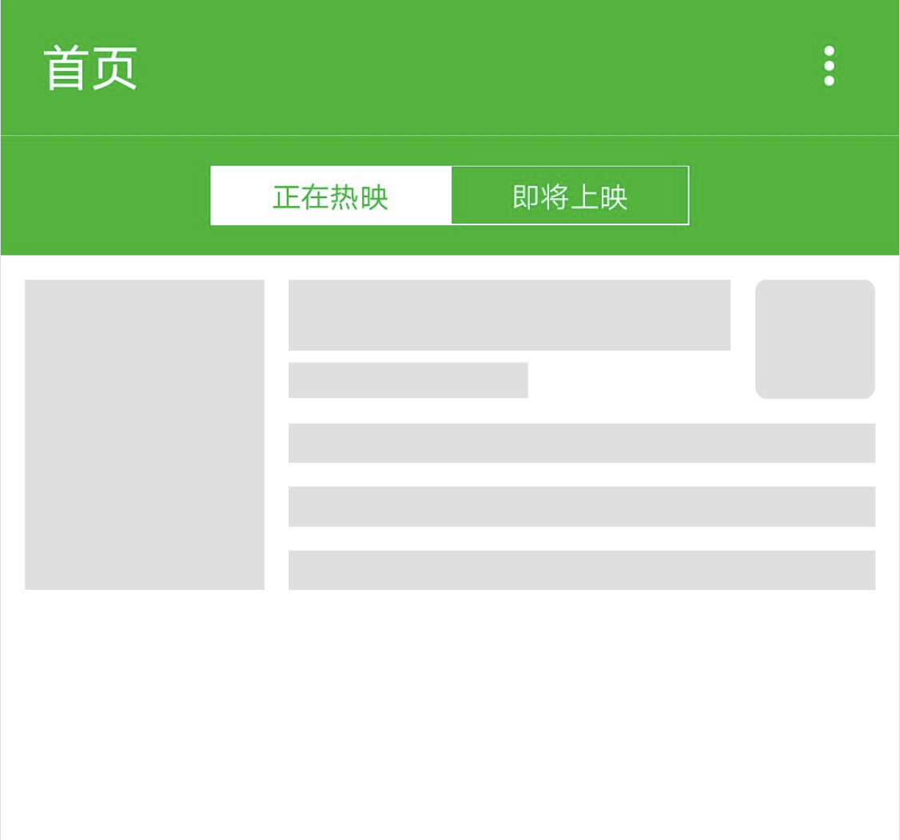

## 快应用开发教程（6）：APP开发实战-细节优化和总结

 经过前几篇教程的开发，我们的开应用基本达到上架使用的水平了，但是作为工程师，当然要更加精益求精，虽然数据和界面都已经完成，但是还有很多细节的地方有优化的空间。下面我们就把整个快应用中优化点列出来，然后一个一个优化它。

* 列表骨架屏加载
* 数据请求错误处理
* 增加获取定位的功能

### 列表骨架屏加载

骨架屏是一种常用的提升用户交互体验的手段，在弱网环境下，数据加载较慢，为了减少等待数据加载导致页面白屏导致的用户流失，我们预先在动态获取的内容处用写好填充的框架，让用户明确知道此处的数据加载，从而降低用户的心理等待时间。

在我们的电影快应用中，数据加载主要是集中在列表中，所以我们主要给列表组件`src/common/component/movieList.ux`添加骨架屏的优化。废话不多说，上代码。

`template`代码

```html
<list-item class="skeleton" type="skeleton" if="!more">
    <div class="skeleton-movie">
        <div class="skeleton-poster bg-grey"></div>
        <div class="skeleton-info">
            <div class="skeleton-top">
                <div class="column">
                    <div class="skeleton-title bg-grey"></div>
                    <div class="skeleton-year bg-grey"></div>
                </div>
                <div class="skeleton-rating bg-grey"></div>
            </div>
            <div class="skeleton-bottom">
                <div class="skeleton-wrap bg-grey"></div>
                <div class="skeleton-wrap bg-grey"></div>
                <div class="skeleton-wrap bg-grey"></div>
            </div>
        </div>
    </div>
</list-item>
```

`style`代码

```css
.skeleton-movie {
    height: 300px;
    width: 100%;
    flex-direction: row;
    justify-content: center;
    padding: 20px;
}

.bg-grey {
    background-color: #dedede;
}

.skeleton-poster {
    width: 200px;
    height: 260px;
    flex-shrink: 0;
}

.skeleton-info {
    height: 260px;
    width: 100%;
    flex-direction: column;
}

.skeleton-top {
    height: 100px;
    width: 100%;
}

.skeleton-title {
    height: 60px;
    width: 100%;
    margin-left: 20px;
}

.skeleton-year {
    height: 30px;
    width: 200px;
    margin-top: 10px;
    margin-left: 20px;
}

.skeleton-rating {
    height: 100px;
    width: 100px;
    border-radius: 10px;
    flex-shrink: 0;
    margin-left: 20px;
}

.skeleton-bottom {
    height: 160px;
    width: 100%;
    flex-direction: column;
}

.skeleton-wrap {
    height: 60px;
    width: 100%;
    margin: 20px 20px 0 20px;
}
```

现在加载数据之前会是这样的效果



### 数据请求错误处理

之前我们数据请求都默认成功的，实际上数据请求在复杂网络环境下是有可能出错的，如果我们没有对应的逻辑处理，会在出错后导致不可预计的问题，界面会没有反馈，交互体验不好，所以我们把请求部分的代码优化一下。这里以首页的请求为例。

```javascript
import prompt from "@system.prompt";
export default {
    getMovieList: function () {
        const that = this; // 保存当前this
        fetch.fetch({
            url: 'https://api.douban.com/v2/movie/' + that.type + '?count=' + that.count + '&start=' + that.start,
            success: function (response) {
                let data = JSON.parse(response.data); // 解析请求回来的数据为对象
                if (response.code === 200) { // 判断当前请求是否成功返回
                    that.movies = that.movies.concat(data.subjects); // 把请求到的数据赋值到定义的变量上去
                    that.start += that.count; // 每次请求成功后给start增加页码
                } else {
                    prompt.showToast({
                        message: '请求出错！错误码：' + response.code
                    })
                }
                if (that.movies.length === data.total) {
                    that.more = true;
                }
            },
            fail: function (err, code) {
                prompt.showToast({
                    message: '请求出错！错误码：' + code
                })
            }
        })
    },
}
```

### 增加获取定位的功能

我们的接口文档里提供了按照传入的城市查询数据的字段，不过我们没有传值，现在我们使用手机的定位接口和百度的位置转换服务把城市传入查询接口。由于快应用的地理位置接口返回的是经纬度，所以我们还需要将其转换成对应的地址 ，好在[百度地图开发者平台](http://lbsyun.baidu.com/)提供了这个转化接口，注册一个账号，登录网站，进入控制台，创建一个应用，拿到应用的AK。准备工作完成，可以开始开发了。

创建`src/common/script/get-city-name.js`文件。

```javascript
const geolocation = require('@system.geolocation');
const fetch = require('@system.fetch');
const prompt = require('@system.prompt');

let location = null; // 保存请求回来的地址
const baiduAK = 'UGM0p4Qn4QTgiGUdYI6F1ZCQETacp43'; // 替换成你自己的百度地图AK

function getCityName() {
    return new Promise(((resolve, reject) => { // 返回一个promise对象
        if (location) { // 判断是否已经缓存了地理位置，避免重复请求
            resolve(location);
        }
        geolocation.getLocation({
            success: function (res) {
                let locationParam = res.latitude + ',' + res.longitude;
                fetch.fetch({
                    url: 'https://api.map.baidu.com/geocoder/v2/?ak=' + baiduAK + '&location=' + locationParam + '1&output=json&pois=1',
                    method: 'GET',
                    success: function (res) {
                        if (res.code === 200) {
                            location = JSON.parse(res.data).result.addressComponent.city;
                            resolve(location);
                        } else {
                            prompt.showToast({
                                message: '请求出错！错误码：' + res.code
                            });
                            reject(res.code);
                        }
                    },
                    error: function (err) {
                        prompt.showToast({
                            message: '请求出错！错误信息：' + err
                        });
                        reject(err);
                    }
                });
            }
        });
    }));

}

export {
	getCityName // 导出获取地理位置的方法
}

```

接下来在首页修改调用的代码

```javascript
onInit: function () {
    getCityName().then((city) => {
        this.city = city; // 保存返回的地理位置
        this.getMovieList(); // 请求电影列表数据
        this.$page.setTitleBar({text: '首页-' + city}); // 设置页面标题
    });
},
```

### 总结

现在终于完成了整个快电影快应用的开发，虽然这个项目不是那么复杂，但是涉及到的东西基本涵盖了快应用开发的大部分，至于很多没有用到了组件和接口，只要按照对应的文档去对接，也不会是太大的难度了。我们熟悉了快应用的从零开发的流程和方法后，就可以进一步熟悉其他组件和接口了，最好是自行再把项目的代码敲一遍，在这个过程中应该会有不一样的体会。

-------------------

作者：dadong

时间：2018.11.26